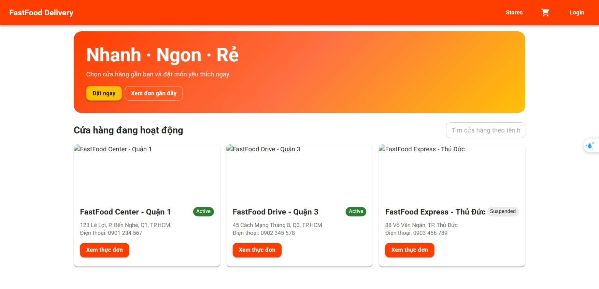
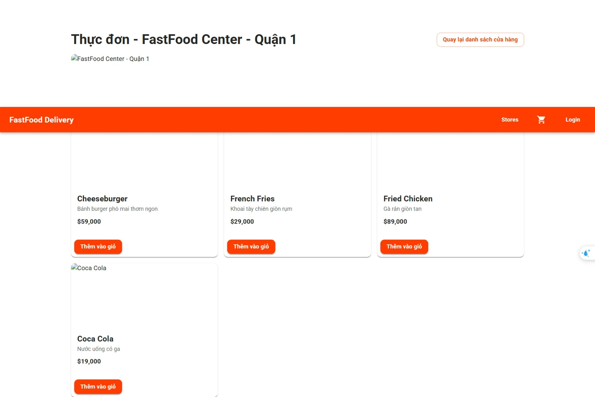

SGU2025_CNPM_NHOM22
Học phần: Công nghệ phần mềm

Giảng viên: TS.Nguyễn Quốc Huy

Lớp: DCT122C3

Nhóm: 22

Thành viên:

Lê Song Nhật Quyền - 3122411174
Đỗ Phú Thành - 3122411189

Tên đề tài: 2/ BE Dev theo hướng 3 lớp cho FoodFast với Drone Delivery

Giới thiệu & mô tả
FoodFast Drone Delivery là hệ thống giao đồ ăn nhanh bằng drone, mang đến trải nghiệm giao hàng hiện đại và tiện lợi. Người dùng có thể đặt món ăn từ các cửa hàng đối tác, thanh toán trực tuyến qua QR code, và nhận đồ ăn trực tiếp từ drone tại vị trí của mình.

Công nghệ sử dụng

Frontend:
ReactJS cho Website: Giao diện (UI/UX) cho khách hàng đặt đồ ăn, theo dõi đơn hàng với GPS tích hợp vào drone. (Admin Portal DashBoard): quản lý merchant, store, menu, đơn hàng, drone fleet và giám sát tracking. 

Backend: 
Srpingboot, Postman, VNPay API, Database MySQL, Drone services và các công nghệ khác sẽ được mô tả trong repo riêng biệt.

<h2>Project screenshots</h2>

<h3>Home page</h3>

<h3>MenuStores page</h3>

<h3>Customer Home page</h3>

<h3>Customer Menu page</h3>

<h3>Merchant Dashboard page</h3>

<h3>Admin dashboard</h3>

