# SGU2025_CNPM_NHOM22

**Học phần:** Công nghệ phần mềm

**Giảng viên:** TS. Nguyễn Quốc Huy

**Lớp:** DCT122C3

**Nhóm:** 22

---

# Tên đề tài
**/ BE Dev theo hướng 3 lớp cho FoodFast với Drone Delivery**

## Giới thiệu & mô tả
FoodFast Drone Delivery là hệ thống giao đồ ăn nhanh bằng drone, mang đến trải nghiệm giao hàng hiện đại và tiện lợi. Người dùng có thể đặt món ăn từ các cửa hàng đối tác, thanh toán trực tuyến qua QR code, và nhận đồ ăn trực tiếp từ drone tại vị trí của mình.

---

## Thành viên
| Họ và tên | Mã số sinh viên |
|---|---:|
| Lê Song Nhật Quyền | 3122411174 |
| Đỗ Phú Thành | 3122411189 |

---

## Swagger API
Mở API docs :

- Swagger UI: `http://localhost:8080/api/swagger-ui/index.html`
- OpenAPI JSON: `http://localhost:8080/api/v3/api-docs`

---

## Công nghệ sử dụng

<!-- Responsive image grid: two rows, small thumbnails. Images live in ./imageTech/ -->
<div style="display:flex;flex-wrap:wrap;gap:12px;justify-content:center;align-items:center;">
  
  
  
  
  
</div>


---

## Chi tiết công nghệ
- Frontend: ReactJS (TypeScript), react-leaflet để hiển thị bản đồ và theo dõi drone.
- Backend: Spring Boot (3-layer architecture), JWT auth, WebSocket cho real-time updates, MySQL cho lưu trữ.
- Thanh toán: VNPay (Callback).
- Docker: Dockerfile cho `frontend` và `backend`, `docker-compose.yml` để khởi dựng multi-container.
- Swagger / OpenAPI: `springdoc` cung cấp UI và JSON.

---

## Docker: Build, Push và Run
1) Build image locally:

```cmd
cd C:\Users\dell\Desktop\fastfood
# Backend image
docker build -t YOUR_DOCKERHUB_USER/fastfood-backend:1.0.0 ./backend
# Frontend image
docker build -t YOUR_DOCKERHUB_USER/fastfood-frontend:1.0.0 ./frontend
```

2) Push to Docker Hub:

```cmd
docker login
docker push YOUR_DOCKERHUB_USER/fastfood-backend:1.0.0
docker push YOUR_DOCKERHUB_USER/fastfood-frontend:1.0.0
```

3) Run with docker-compose (from repo root):

```cmd
# build và khởi chạy
docker-compose up --build -d
# xem logs
docker-compose logs -f backend
```


<h2>Project screenshots</h2>

<h3>Customer Home page</h3>

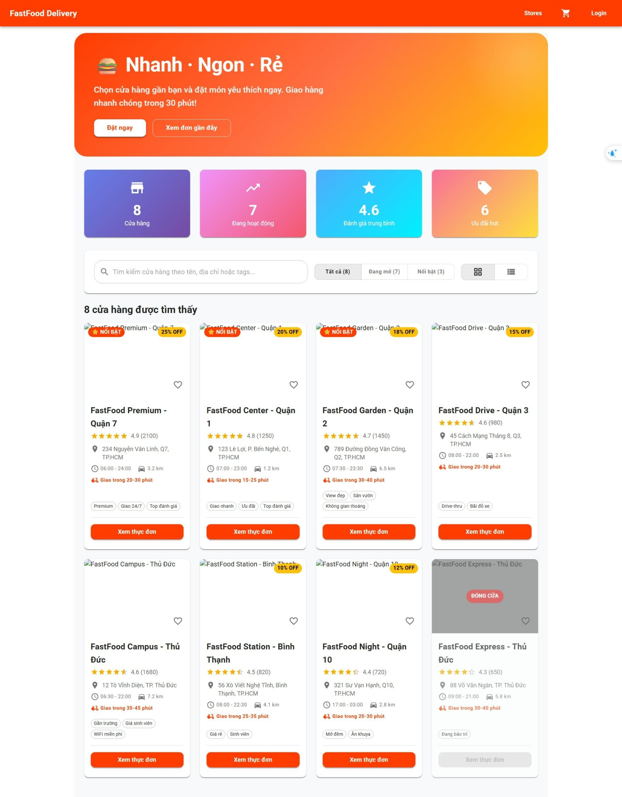

<h3>Customer Menu page</h3>

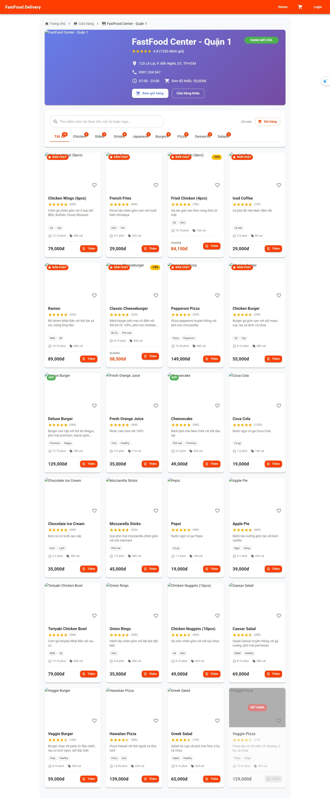

<h3>Merchant Dashboard page</h3>

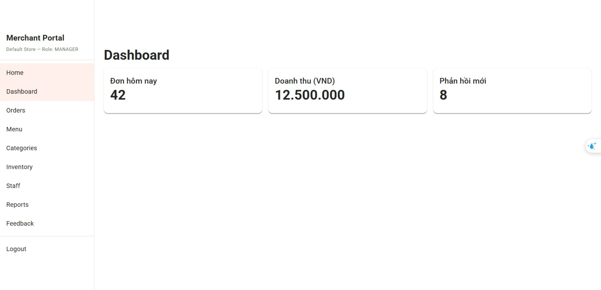

<h3>Merchant Categories page</h3>

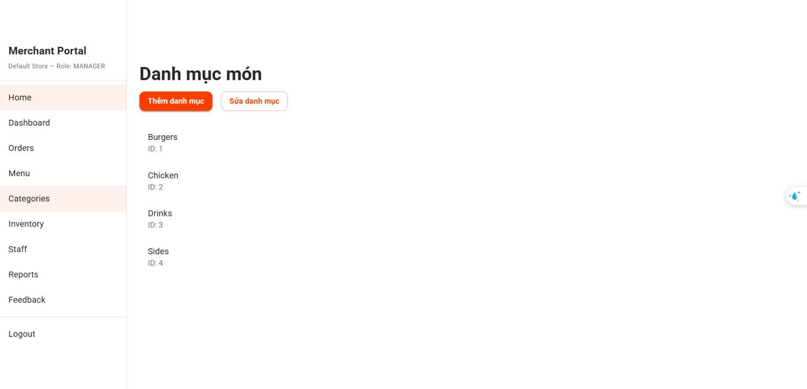

<h3>Merchant Feedback page</h3>

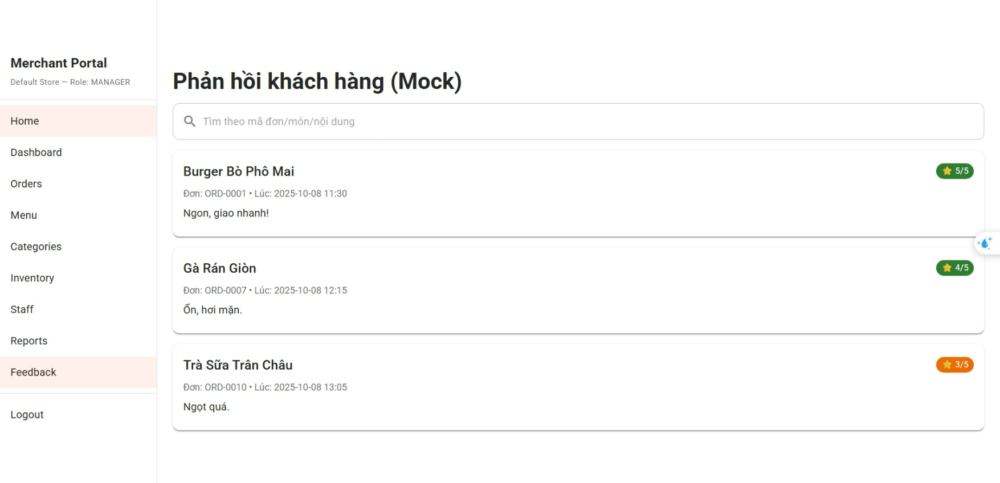

<h3>Merchant Inventory page</h3>

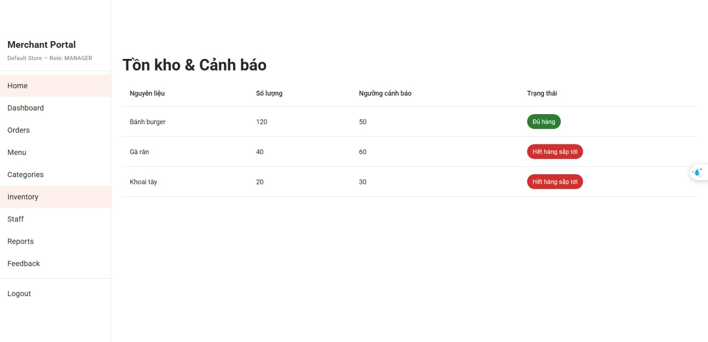

<h3>Merchant Menu page</h3>

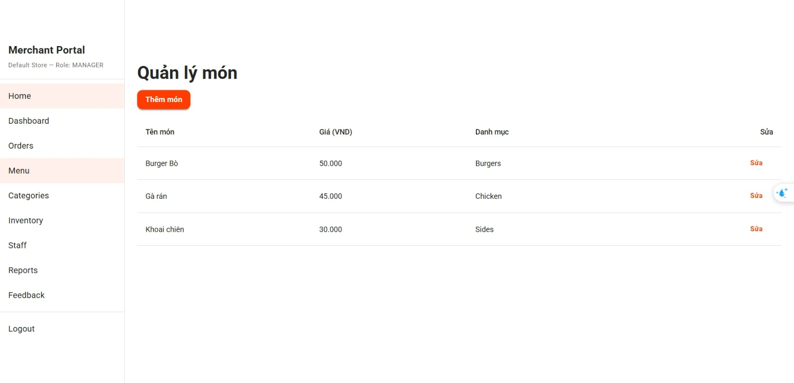

<h3>Merchant Orders page</h3>


<h3>Merchant Reports page</h3>

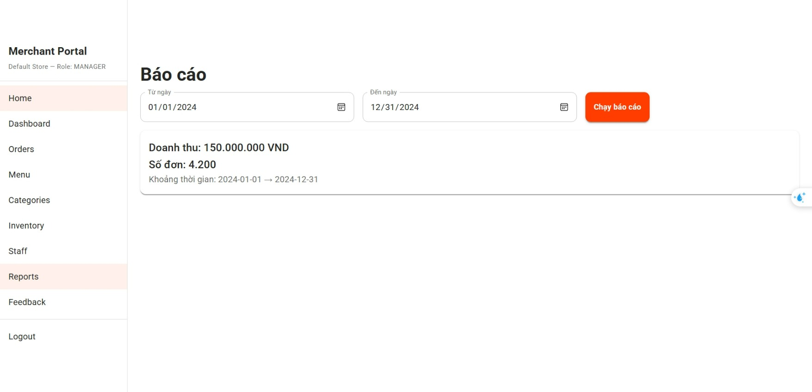

<h3>Merchant Staff Management page</h3>

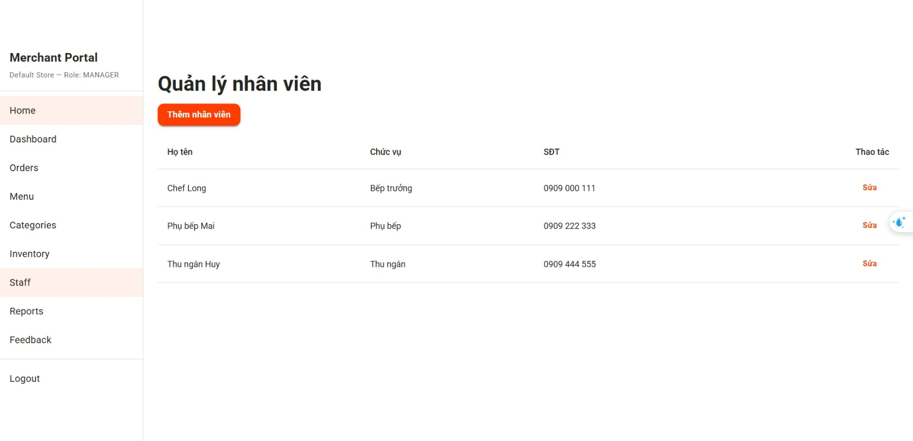

<h3>Admin Dash Board</h3>

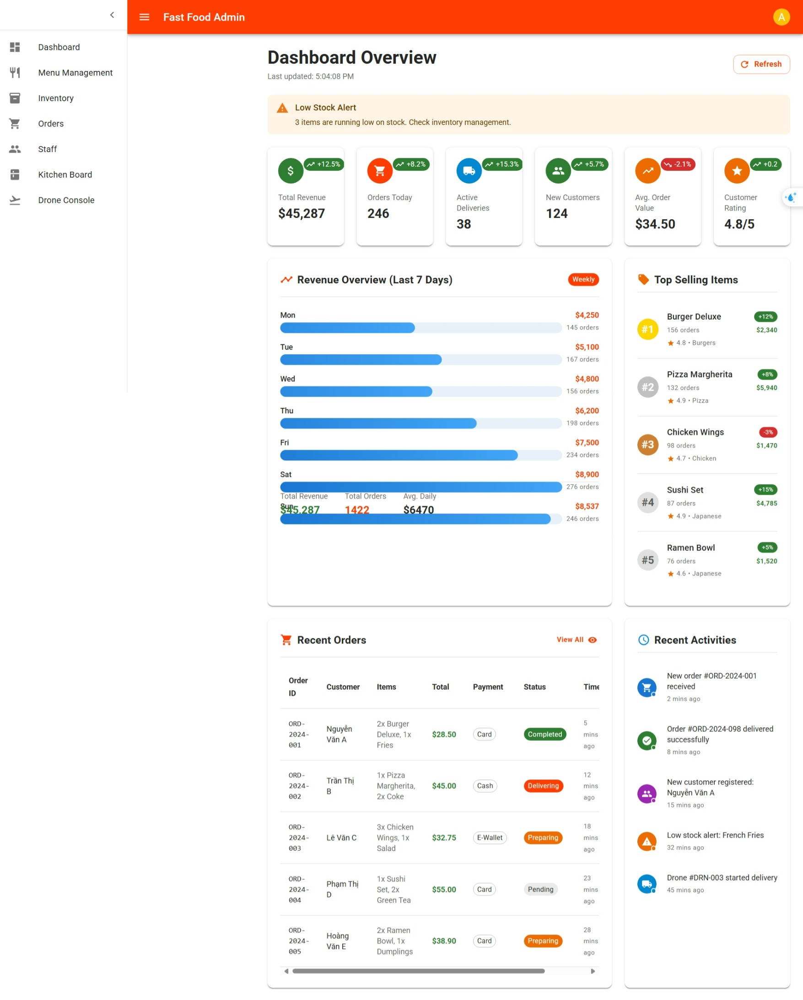

<h3>Admin Menu Management</h3>

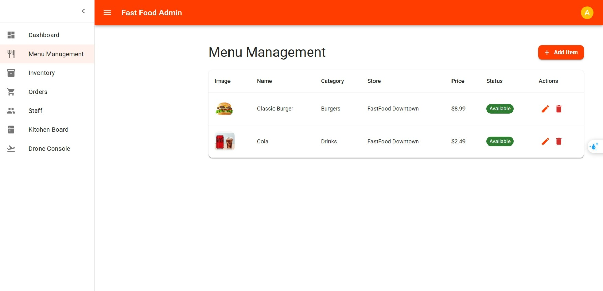

<h3>Admin Inventory Management</h3>

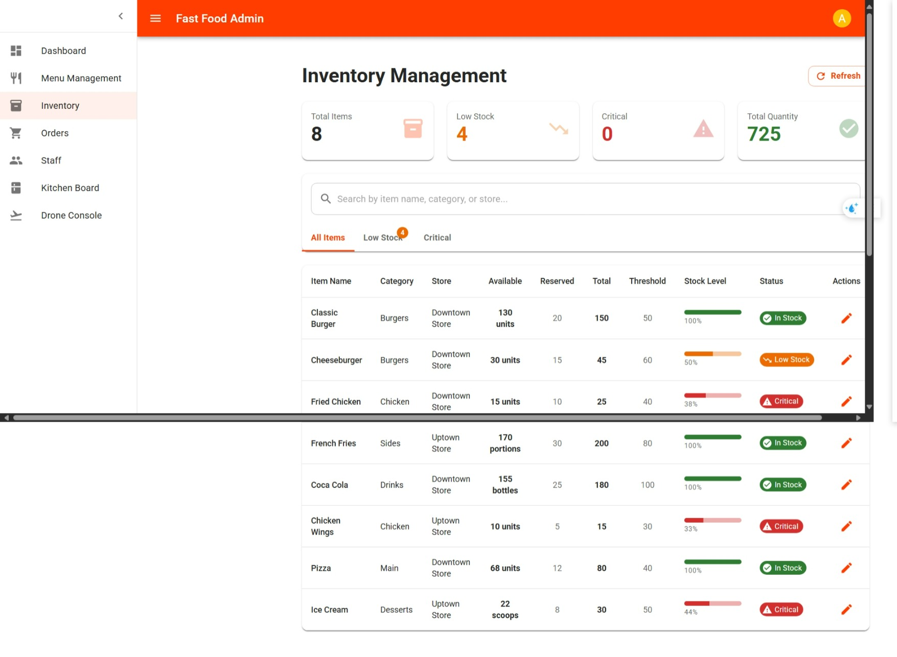

<h3>Admin Orders Management</h3>

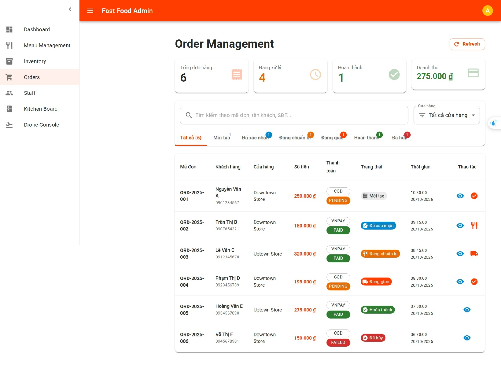

<h3>Admin Staff Management</h3>

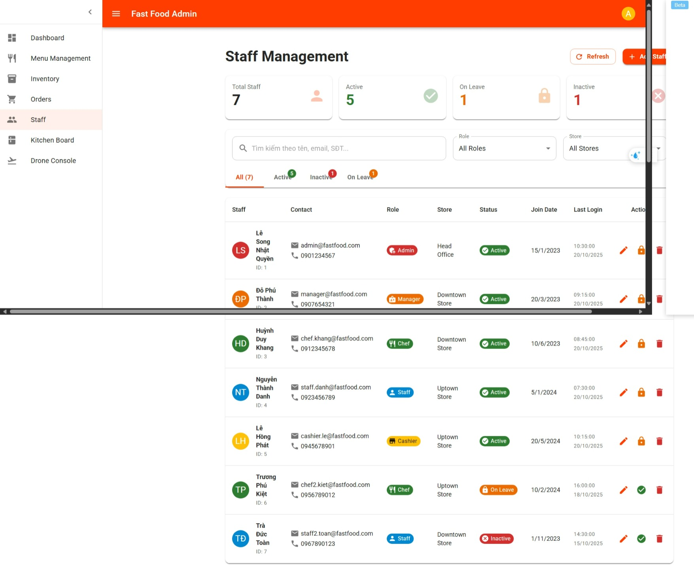

<h3>Admin Kitchen Board</h3>

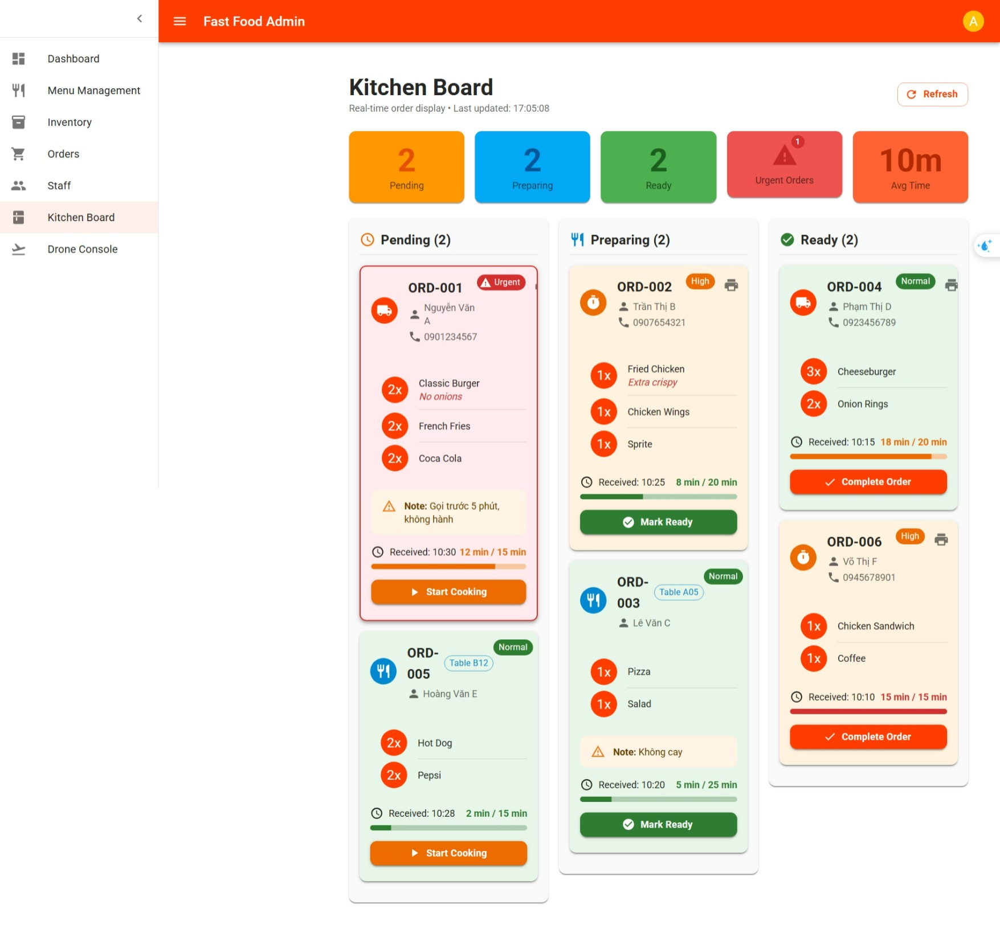

<h3>Admin Drone Console</h3>

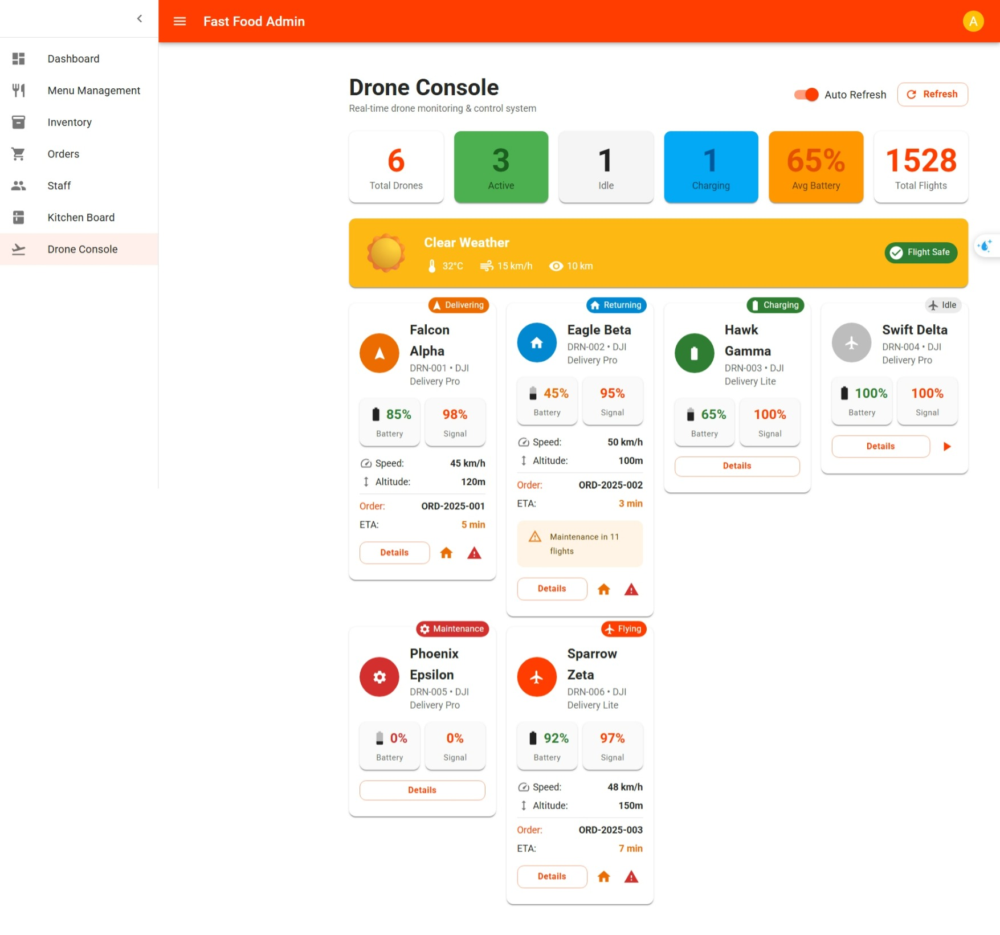
